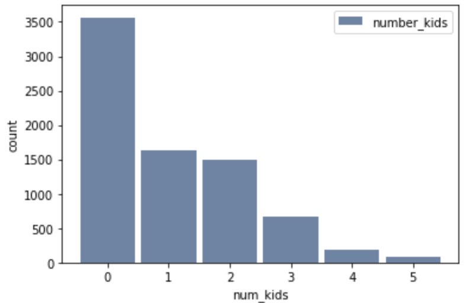
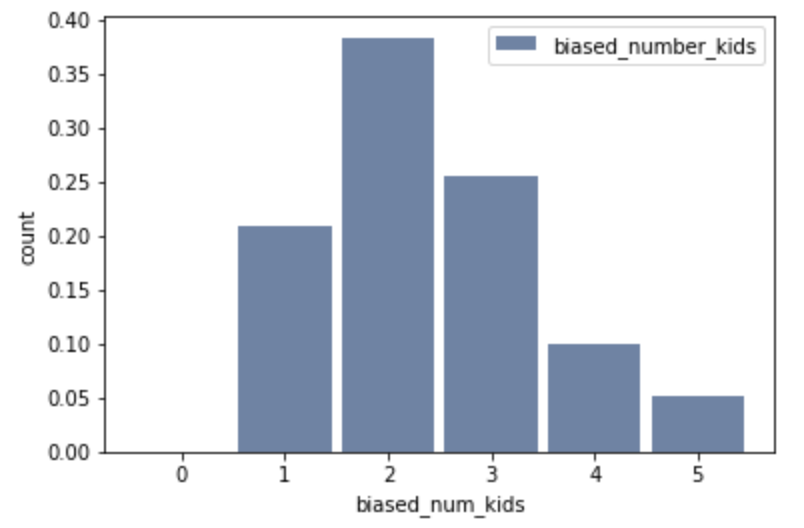

[Think Stats Chapter 3 Exercise 1](http://greenteapress.com/thinkstats2/html/thinkstats2004.html#toc31) (actual vs. biased)

Using the NSFG data i was able to create the distribution for the number of children under 18 in the household:

```python
num_kd = resp.numkdhh
num_kd_hist = thinkstats2.Hist(num_kd, label='number_kids')
thinkplot.Hist(num_kd_hist)
thinkplot.Config(xlabel='num_kids', ylabel='count')
```



After this i was able to produce the biased distribution as observed by the kids:

```python
biased_num_kd_hist = thinkstats2.Hist(biased_pmf, label='biased_number_kids')
thinkplot.Hist(biased_num_kd_hist)
thinkplot.Config(xlabel='biased_num_kids', ylabel='count')
```

