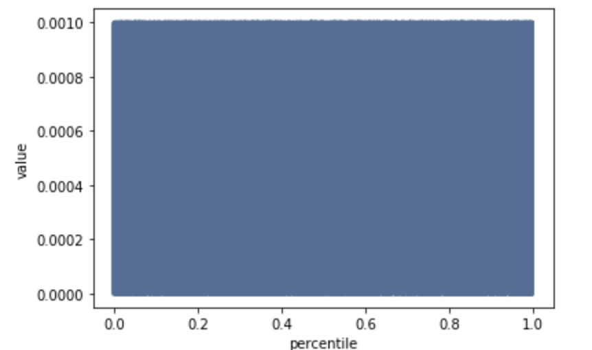
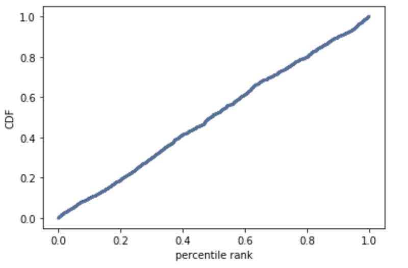

[Think Stats Chapter 4 Exercise 2](http://greenteapress.com/thinkstats2/html/thinkstats2005.html#toc41) (a random distribution)

Here is the code to generate 1000 random numbers:

```python
rnd_nums = []

for x in range(1000):
    rnd_nums.append(random.random())
```

Here is the code and plot of PMF:
```python
pmf = thinkstats2.Pmf(rnd_nums)
thinkplot.Pmf(pmf)
thinkplot.Show(xlabel='percentile', ylabel='value')
```



Here is the code and plot of CDF:
```python
cdf = thinkstats2.Cdf(rnd_nums)
thinkplot.Cdf(cdf)
thinkplot.Show(xlabel='percentile rank', ylabel='CDF')
```



